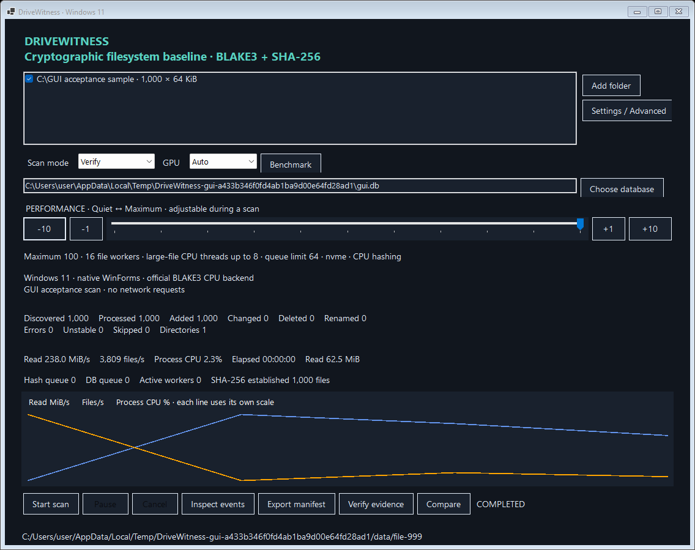

# Windows 11 C# validation and performance

## Before/after profile

Measured locally on Windows 11 build 26220, 24 logical/12 physical CPUs, approximately 63 GiB RAM, and a detected NVMe NTFS volume. Dataset: 2,000 × 4 KiB files plus four × 16 MiB files, **75,300,864 bytes**. Three repetitions per strategy, mostly warm filesystem cache. Maximum performance, no USN optimization. The original SHA-1 loop provides weaker guarantees.

| Implementation | Median seconds | C# engine-only seconds |
|---|---:|---:|
| Original Python, SHA-1 only | 0.503 | 0.000 |
| Modern Python, one file worker | 2.459 | 0.000 |
| Modern Python, adaptive workers | 1.568 | 0.000 |
| C#, one file worker | 1.100 | 0.976 |
| C#, adaptive workers | 0.597 | 0.464 |

Python timings exclude module imports. C# process timings include startup/JIT, JSON output, and up to 10 ms observer polling granularity; engine timings exclude process startup. Reverse interoperability checks occur after timed C# processes. Zero in the engine column means that separate measurement was unavailable for Python. Timing variation and cache effects limit conclusions.

C# adaptive collection used **61.9% less elapsed time** than modern Python adaptive collection in this sample. Adaptive C# used 45.7% less time than C# with one file worker. The original SHA-1 collector's speed is not an equivalent correctness/performance target.

The measured limiting subsystem is **metadata/identity checking**, about 67.2% of aggregate instrumented service time. It includes mandatory native identity/time observations and resolved-handle path checks. SQLite inserts plus commits represent 3.0%; Merkle construction 11.0%; content reads 7.2%. Service times overlap across workers and are not fractions of wall-clock time. Enumeration wall time includes queue backpressure and is excluded from these percentages. Scheduling/JIT are not separately instrumented.

Observed adaptive C# peak process working set in the reported repetition: 100.7 MiB. Queue/task/batch sizes are structurally bounded independently of file count. The 2,000-file queue test validates those ceilings; this is not an empirical million-file or whole-drive memory test.

The bounded benchmark reads at most 16 existing sample files totaling 64 MiB, tests sequential reads, serial/parallel BLAKE3, SHA-256, dual hashing, worker counts, and 5,000 temporary SQLite rows. It includes OS cache effects and recommends settings for review. No huge benchmark files are written, and no GPU accelerator is advertised.

## Published GUI acceptance

- First window shown: **170.8 ms** from managed program startup; excludes OS process loading before `Main`.
- Maximum-performance sample: 1,000 × 64 KiB, with both digests established in one read and zero file errors.
- UI timer requested 20 ms; largest observed gap **55.6 ms**, 32 heartbeats.
- Native -10/-1/+1/+10 buttons were exercised and their values checked.
- Background collection completed; form rendering and event-loop responsiveness passed.

The application-owned acceptance form is hidden and captured using WinForms `DrawToBitmap`; no desktop screenshot is required. Measurements include sample creation and scan activity in the heartbeat interval. This is one run, not a percentile or broad DPI/display matrix.

## Verification

Release build: zero warnings/errors, nullable analysis and warnings-as-errors enabled. **84 C# tests pass**: known digests, single-read baselines, carry-forward/recalculation, timestamp-restored changes, replacement/deletion/renames, hard links, junction loops and ancestor redirection, Unicode/long paths, large/empty files, cancellation/pause/throttle, bounded queues, killed-process recovery, deterministic/empty/odd Merkle reduction, legacy SHA-1 migration, signing/trusted keys/timestamp failure, GPU fallback, and controlled USN continuity/race/failure cases.

The retained Python suite also passes 49 tests after relocation. Python validates newly generated C# roots/manifests and signed manifests; C# validates fixed Python UTF-8/UTF-16 inventory roots and encrypted-key signatures. Published GUI/CLI runs passed, and runtime configuration embeds .NET 10.0.12; CLI live verification also passed with installed-runtime lookup disabled.

Actual raw journal access was denied in this unelevated session; full-hash fallback and its event were observed. Elevated full-volume journal collection and ARM64 execution remain untested. No enabled GPU hasher, trusted timestamp service, ADS/VSS collection, or guarantee of zero bottlenecks is claimed.

Machine-readable evidence: [profile](CSHARP_PERFORMANCE_REPORT.json), [GUI acceptance](CSHARP_GUI_REPORT.json). Reproduce with `scripts/port_performance_report.py` (development Python only), `scripts/build.ps1`, `scripts/publish.ps1`, and `scripts/test-gui.ps1`.
