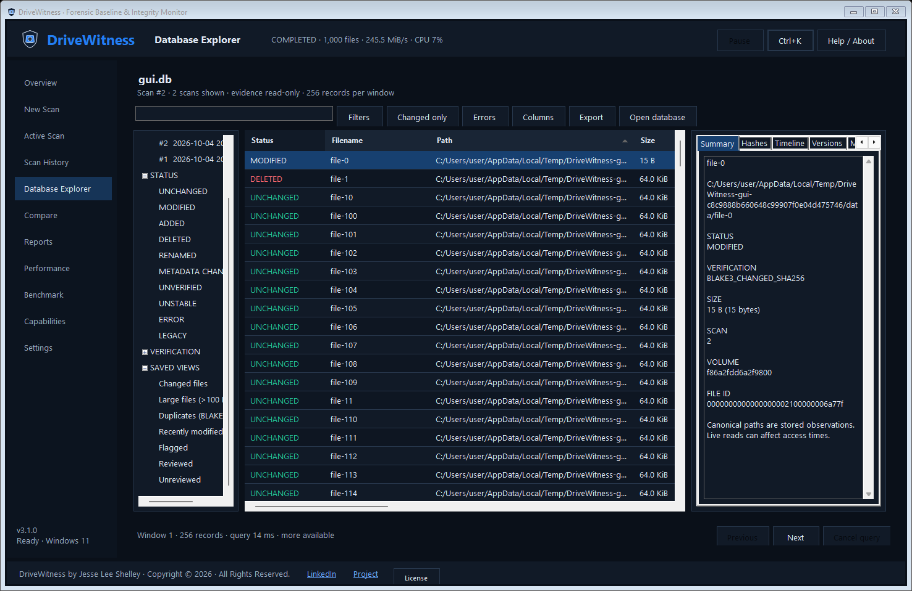
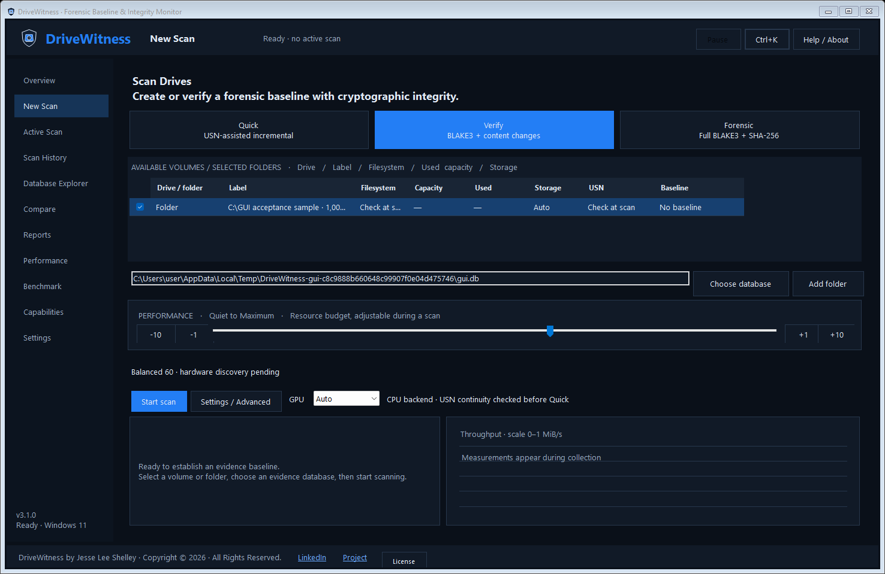
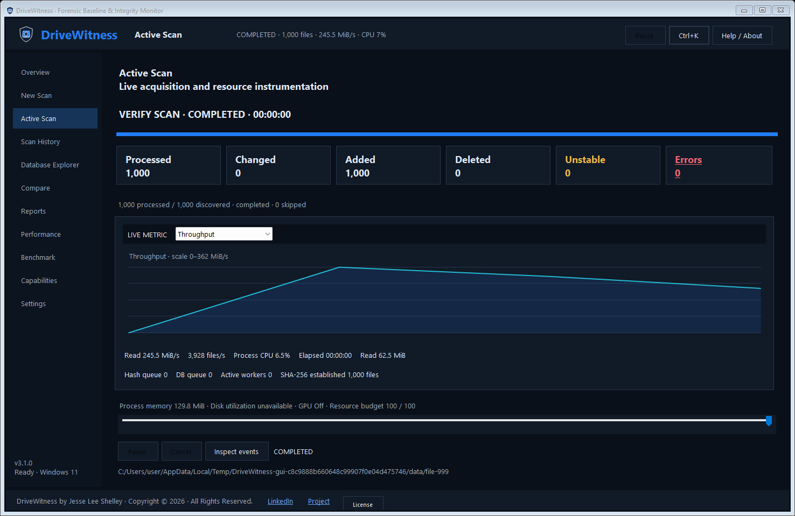

# DriveWitness · Forensic Baseline & Integrity Monitor

DriveWitness 3 is a native **C#/.NET 10 WinForms application for Windows 11**, with a separate C# CLI. It collects a tamper-evident filesystem baseline using BLAKE3, SHA-256, explicit verification provenance, and SQLite evidence storage.

The published application includes its .NET runtime. **Python is not required.** The runtime platform check rejects Windows 10, Windows Server, and other operating systems. The tested distribution is Windows 11 x64.

## Run

Download the [Windows 11 x64 ZIP](https://github.com/ultros/DriveWitness/releases/download/v3.1.0/DriveWitness-3.1.0-win-x64.zip), extract the entire ZIP, and open `win-x64/DriveWitness.exe`. Keep its DLLs and runtime files together. In this development checkout:

```powershell
.\artifacts\win-x64\DriveWitness.exe
.\artifacts\win-x64\drivewitness-cli.exe --help
```

Select drives or add a folder, choose a database, and start scanning. Reusing a database with the same scope appends a new pass linked to the last completed baseline.

The **0–100 performance bar and -10/-1/+1/+10 buttons work during a scan**. The budget controls file concurrency, queue depth, Quiet pacing, and serial versus parallel large-file hashing. Lowering it lets active work drain safely. It is a resource hint, not an exact CPU percentage.

Use the permanent navigation for New Scan, Active Scan, Scan History, Database Explorer, Compare, Reports, Performance, Benchmark, Capabilities and Settings. The top bar retains collection status and Pause/Resume across pages. Reports contains distinct SQLite structural checks and cryptographic root checks, plus manifest export. Settings / Advanced contains commit thresholds, worker overrides, filtering, USN/network-time options, external anonymization keys, and Ed25519 signing. Settings and workspace preferences are saved under `%LOCALAPPDATA%\DriveWitness`; scope globs and key selections are session settings. Signing passwords remain in memory for the session.

## Database Explorer · 3.1



Open existing evidence with **Ctrl+O**, or launch directly with `DriveWitness.exe --explore evidence.db`. The explorer operates independently of collection. Its three panes provide scan/status/verification views, a virtual evidence table, and a file inspector with Summary, Hashes, Timeline, Versions, Metadata, Errors and Notes.

Queries filter and sort inside SQLite and use keyset windows of at most 256 records. Next/Previous navigates results without loading the complete database. Search is debounced and cancellable. Hash prefixes use indexed binary ranges; universal substring searches can require a database scan. Resize, reorder, show/hide or pin columns; their layout persists. Full digests appear in tooltips, the inspector and copied/exported records.

Right-click records for previous-version and current-disk comparisons, full dual rehashing, same-hash/file-ID searches, duplicates, copy actions, filesystem location/properties, review notes and selected-record exports. Current-disk verification never replaces the historical observation. Optional persisted verification events and analyst annotations are stored in **`<evidence>.review.db`**, outside the evidence roots. Keep that sidecar with evidence when you need to retain review work.

Compare completed scans within the same scope on Compare. Comparison records use SQL-derived statuses; inferred deletions retain the actual historical scan ID and display `COMPARISON_INFERRED`. Incomplete coverage produces `UNVERIFIED` rather than inferred deletion. Versions remains a bounded, pageable history view. Scan catalogs display the latest 500 entries.

Reports stream CSV, JSON, JSONL and HTML from one SQLite snapshot, with source database, filters, scan IDs, export time, version and creator attribution. Exports cannot overwrite the source database or its support files. **Ctrl+K** opens the command palette, **Ctrl+F** focuses evidence search, **Ctrl+C** copies full selected values, **Ctrl+Shift+C** copies a complete record, and **F5** refreshes.




Administrator access may be needed for protected files and NTFS journal access. Access failures are recorded. DriveWitness does not change permissions or create/enable journals.

## Features

- Background drive, storage, CPU, and GPU discovery after rendering the window.
- Official optimized Rust BLAKE3 through `Blake3.Native`, plus .NET SHA-256.
- Both baseline digests calculated from one content read.
- Bounded multithreading, one SQLite writer, prepared inserts, and time/row commits.
- Large-file hashing reserves the native pool instead of oversubscribing it with parallel readers.
- Windows file identities, rename tracking, hard-link relationships, and pre/post read stability checks.
- NTFS USN-assisted Quick verification with continuity checks and full-hash fallback.
- Long paths, Unicode names, zero-byte files, and explicit reparse-point exclusions.
- Deterministic content/metadata Merkle roots and encrypted-PEM Ed25519 signing.
- HMAC path anonymization using an external 32+ byte key, never stored in evidence.
- Local UTC and optional HTTPS clock observations, distinct from trusted timestamps.
- WAL storage, partial evidence retention, and failed/interrupted crash recovery statuses.
- Live throughput, process CPU, queues/counters, and a lightweight rolling graph.
- Bounded read-only benchmarks with cached recommendations for review.
- Compatibility with compressed legacy SHA-1 tables and Python-era version 2 evidence.

GPU hardware is detected, but **no GPU hashing backend ships enabled**. Auto/Force safely use the validated CPU backend. Accelerator and trusted timestamp-provider interfaces support future integrations; no RFC 3161 client is configured.

## Scan modes

| Mode | Content policy | Durability |
|---|---|---|
| Quick | Carry eligible USN-verified content; hash dirty/new files; full fallback when journal checks fail | WAL + NORMAL |
| Verify, default | Read BLAKE3; carry established SHA-256 when unchanged; reread SHA-256 when changed | WAL + NORMAL |
| Forensic | Calculate both digests in the same read | WAL + FULL |

New baselines always establish both digests. Same-scan hard-link reuse requires a stable per-file USN and is explicit in provenance; otherwise paths are independently read. Baseline enumeration avoids extra identity handles solely for hard-link deduplication. USN saves content reads while namespace enumeration still walks the selected tree.

`COMPLETED` means collection finished its policy, not that every file was accessible. Inspect manifest `coverage_complete`, errors, unstable files, and skipped entries. NORMAL durability can lose recent transactions after power failure; Forensic requests stronger flushes.

## CLI

From the published directory:

```powershell
.\drivewitness-cli.exe list
.\drivewitness-cli.exe capabilities
.\drivewitness-cli.exe scan C: D: --db evidence.db --mode verify --performance 60
.\drivewitness-cli.exe scan C:\Evidence --db evidence.db --mode quick
.\drivewitness-cli.exe scan C:\Evidence --db evidence.db --mode forensic --gpu off
.\drivewitness-cli.exe scan C:\Evidence --db evidence.db --resume --json
.\drivewitness-cli.exe verify evidence.db
.\drivewitness-cli.exe verify evidence.db --live
.\drivewitness-cli.exe compare baseline.db newer.db
.\drivewitness-cli.exe export evidence.db --output manifest.json
.\drivewitness-cli.exe errors evidence.db > events.jsonl
.\drivewitness-cli.exe benchmark C:\Evidence --save-settings
.\drivewitness-cli.exe migrate legacy.db --output upgraded.db
.\drivewitness-cli.exe search --db evidence.db --scan-id 2 --status MODIFIED
.\drivewitness-cli.exe search --db evidence.db --blake3 4f129 --limit 256
.\drivewitness-cli.exe history --db evidence.db
.\drivewitness-cli.exe health --db evidence.db --integrity
.\drivewitness-cli.exe compare-scans --db evidence.db --baseline-scan 1 --scan-id 2
.\drivewitness-cli.exe versions --db evidence.db --scan-id 2 --path C:/Evidence/file.txt
.\drivewitness-cli.exe verify-file --db evidence.db --scan-id 2 --path C:/Evidence/file.txt --dual
.\drivewitness-cli.exe export --db evidence.db --scan-id 2 --format jsonl --output records.jsonl
```

`--resume` starts a fresh pass and retains interrupted evidence; it does not skip unverified partial work. Stored verification checks roots/signatures. Live verification performs a temporary Forensic collection and compares live inventory/content, leaving the source database unchanged.

```powershell
# Preserve the external HMAC key for subsequent comparisons.
.\drivewitness-cli.exe scan D: --db private.db --anonymize D: --anonymization-key C:\Keys\paths.key
.\drivewitness-cli.exe verify private.db --live --root D: --anonymize D: --anonymization-key C:\Keys\paths.key

# Use an externally generated Ed25519 PKCS8 PEM key.
$env:DW_SIGN_PASSWORD = 'your key password'
.\drivewitness-cli.exe scan C:\Evidence --db signed.db --sign-key C:\Keys\sign.pem --sign-password-env DW_SIGN_PASSWORD
.\drivewitness-cli.exe verify signed.db --trusted-public-key C:\Keys\public.raw
Remove-Item Env:\DW_SIGN_PASSWORD
```

Include/exclude globs and anonymous roots are repeatable flags. See `--help` for chunk sizes, worker/thread caps, commit intervals, retries, JSON output, and rotated diagnostic logging. `--scan`/`--list` aliases remain supported. Exit codes: 0 success, 2 invalid verification, 130 cancellation, 1 command/collection failure. Per-file access failures appear in scan summaries.

## Evidence compatibility

The additive evidence schema remains **version 2**: `dw_scans`, `dw_files`, `dw_volumes`, `dw_events`, and `dw_signatures`. Original `files`/`scans` tables remain unchanged. Six targeted indexes support file history, same-hash lookup, size and modified-time sorting in collector-opened databases. Opening the explorer is read-only and does not add indexes to an older database. Migration copies SQLite through its backup API to a new path and adds modern tables; it does not invent stronger baselines from SHA-1. Pure legacy and migrated legacy databases remain reviewable without a modern baseline.

Compressed path/time fields retain zlib UTF-8. C# canonicalization reproduces Python-era roots, including UTF-16 SQLite ordering and Unicode escaping. Encrypted Python-generated keys/signatures are covered by interoperability tests. C# machine-ID generation differs from the former Python implementation. See [EVIDENCE_FORMAT.md](EVIDENCE_FORMAT.md).

## Build and test

Install the .NET 10 SDK, then run PowerShell in this repository:

```powershell
.\scripts\build.ps1
.\scripts\publish.ps1
.\scripts\test-gui.ps1
```

Publishing produces self-contained GUI/CLI executables and a ZIP in `artifacts`. `-Runtime win-arm64` can build ARM64, but that distribution has not been run on ARM64 hardware here. x64 is the tested default.

Pinned runtime packages: `Microsoft.Data.Sqlite` 10.0.12, `Blake3.Native` 3.0.2, and `BouncyCastle.Cryptography` 2.7.0. xUnit/Microsoft.NET.Test.Sdk are development-only. See [THIRD_PARTY_NOTICES.md](THIRD_PARTY_NOTICES.md).

The previous Python code, tests, and reports remain under [legacy/python](legacy/python). Python is used only by optional development profiling and fixture-generation scripts.

## Results and limits

The current suite passes **104 tests**, including forced process-exit recovery, pagination, legacy browsing, reviews, live comparison, exports and CLI integration. GUI acceptance checks startup, heartbeat responsiveness, live resource changes and bounded explorer windows. See [MODERNIZATION_REPORT.md](MODERNIZATION_REPORT.md) for measurements, screenshots, architecture and remaining limitations. The older [CSHARP_PERFORMANCE_REPORT.md](CSHARP_PERFORMANCE_REPORT.md) describes the 3.0 port.

The mixed-file profile is **metadata/identity-bound**; SQLite accounts for about 3% of aggregate measured subsystem service time. Local C# measurements beat the modern Python engine, but cannot remove physical storage/metadata limits or establish whole-drive throughput from warm-cache tests.

Collection covers default data streams, excludes reparse targets, and does not collect ADS, security descriptors, or a VSS snapshot. Disk/GPU utilization and reliable ETA are unavailable. Restart to change the native BLAKE3 pool cap; the live bar selects serial/parallel large-file hashing within it.

A baseline records observations over time, not an atomic disk snapshot. Reads can update Windows access times or hydrate cloud files. DriveWitness cannot establish correctness on a compromised endpoint, prevent privileged tampering, or make SQLite audit-proof. Preserve signed manifests and independently trusted public keys outside the scanned machine. Collect only data you are authorized to scan.

## License and attribution

DriveWitness by **Jesse Lee Shelley**. Copyright (c) 2026 Jesse Lee Shelley. All Rights Reserved.

[LinkedIn](https://linkedin.com/in/jesse-shelley) · [Project](https://github.com/ultros/DriveWitness)

DriveWitness uses the **Free-Use No-Resale License**, adapted from AllianceWatch's version 2.0 terms. Free use, modification and free sharing with attribution are permitted, including internal business use. Resale, paid distribution and paid access require the owner's separate paid written agreement. This is source-available software with resale restrictions. See [LICENSE](LICENSE), [NOTICE](NOTICE) and [THIRD_PARTY_NOTICES.md](THIRD_PARTY_NOTICES.md). Earlier valid license grants remain effective; the previous GPL notice is preserved under `licenses/`.
